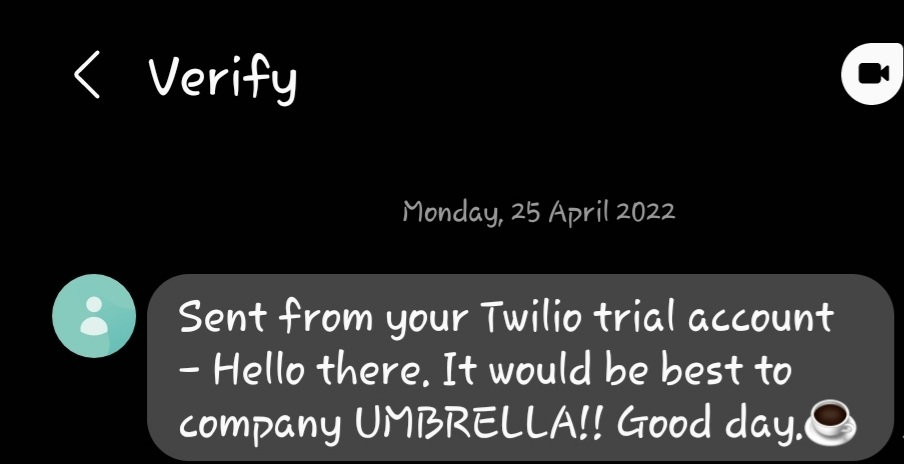

# Personal-Rain-Alert
This script messages us every morning.  It awares me to take umberalla if it is going to rain that day.

### Used links and modules
* Openweather API end point [Openweather](https://openweathermap.org/api) for fetching the weather of the next 12 hours.
* [Twilio](https://www.twilio.com/) fremium account for sending messages to my mobile phone.
* [Python-dotenv](https://pypi.org/project/python-dotenv/) for securing the API keys, TWILIO_ACCOUNT_SID and TWILIO_AUTH_TOKEN from public access.
* Set your location's ***longitude*** and ***latitude***  on line number 12 and 13.
* (Requests)[https://pypi.org/project/requests/]  module facilitating sending HTTP/1.1 requests extremely easily.

I can install python-dotenv using ```pip install python-dotenv```.

🌶🌶🌶🌶🌶🌶🌶🌶🌶🌶🌶🌶🌶🌶🌶🌶🌶🌶🌶🌶🌶🌶🌶🌶🌶🌶🌶🌶🌶🌶🌶





I have hosted the script on [PythonANyWhere](pythonanywhere.com/) to run the script at exact 7AM every morning.

Thanks.

If you have any suggestions to me, YOU know how anti-closed mind I have.


:nerd_face::nerd_face::nerd_face::nerd_face::nerd_face:
